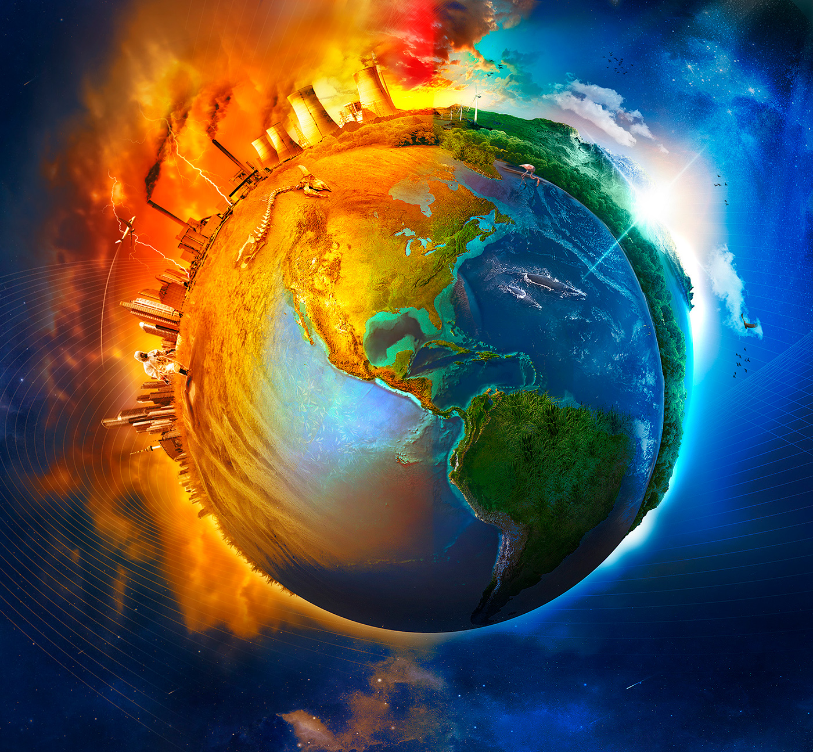

<meta charset="utf-8">
<html>
<head>
    <title>Portal básico</title>
    
</head>
<body>
    

	    <a href="Principal.html" class="activo">PRINCIPAL</a>
        <a href="Tablas.html">TABLAS</a>
        <a href="Video.html">VIDEO</a>
        <a href="Formulario.html">FORMULARIO</a>
    

	

        
    

    

        <ul>
		    <h1>‎MENU</h1>
            <li><a href="Principal.html">PRINCIPAL</a></li>
            <li><a href="Tablas.html">TABLAS</a></li>
            <li><a href="Video.html">VIDEO</a></li>
            <li><a href="Formulario.html">FORMULARIO</a></li>
        </ul>
    

    

    <h2>¿Qué es el cambio climático?</h2>
    
El cambio climático es un fenómeno de gran relevancia en la actualidad y representa uno de los mayores desafíos que la humanidad enfrenta en el siglo XXI. Este proceso consiste en la alteración de las condiciones climáticas en nuestro planeta, con consecuencias significativas que afectan a nivel global.

    
Entre los efectos más notables del cambio climático se incluyen:

    
<strong>1. Aumento de la temperatura global:</strong> El calentamiento del planeta es una de las manifestaciones más evidentes del cambio climático. A medida que aumenta la concentración de gases de efecto invernadero en la atmósfera, como el dióxido de carbono (CO2) y el metano (CH4), se genera un efecto invernadero que atrapa el calor del sol, elevando las temperaturas en la superficie terrestre.

    
<strong>2. Cambios en los patrones de precipitación:</strong> El cambio climático también provoca alteraciones en los patrones de lluvia y sequía en diferentes regiones del mundo, lo que puede tener un impacto significativo en la disponibilidad de agua dulce y la agricultura.

    
<strong>3. Deshielo de los glaciares:</strong> Los glaciares en todo el mundo se están derritiendo a un ritmo acelerado debido al aumento de las temperaturas, lo que contribuye al aumento del nivel del mar y a la pérdida de hábitats de vida silvestre.

    
<strong>4. Aumento del nivel del mar:</strong> Como resultado del deshielo de los glaciares y la expansión térmica del agua, el nivel del mar está aumentando, lo que representa una amenaza para las comunidades costeras en todo el mundo.

    
<strong>5. Pérdida de biodiversidad:</strong> Los cambios en el clima pueden alterar los ecosistemas y poner en peligro a numerosas especies, lo que lleva a la pérdida de biodiversidad y desequilibrios en los ecosistemas.

    
<strong>6. Eventos meteorológicos extremos:</strong> El cambio climático puede aumentar la frecuencia e intensidad de eventos climáticos extremos.

     

        
    

	
La principal causa del cambio climático es la actividad humana, en particular la emisión de gases de efecto invernadero derivados de la quema de combustibles fósiles (carbón, petróleo y gas), así como la deforestación, la agricultura intensiva y otros procesos industriales. Estos gases se acumulan en la atmósfera y actúan como una manta térmica, atrapando el calor y elevando gradualmente la temperatura global.

    
Para abordar este desafío, es fundamental tomar medidas urgentes y coordinadas a nivel mundial, regional y local. Uno de los acuerdos más importantes en este sentido es el Acuerdo de París de 2015, que fue suscrito por casi 200 países. El objetivo principal del acuerdo es limitar el aumento de la temperatura global a no más de 1.5°C con respecto a los niveles preindustriales. Esto implica reducir las emisiones de gases de efecto invernadero y avanzar hacia una transición hacia fuentes de energía más limpias y sostenibles.

    
En resumen, el cambio climático es un fenómeno complejo y global que tiene efectos profundos en nuestro planeta y en la vida de las personas. Abordar este desafío requiere de un esfuerzo conjunto a nivel mundial y la adopción de medidas concretas para mitigar sus impactos y promover la sostenibilidad ambiental.

    

        Autor: Juan Carlos Yepes Gomez
    

</body>
</html>
